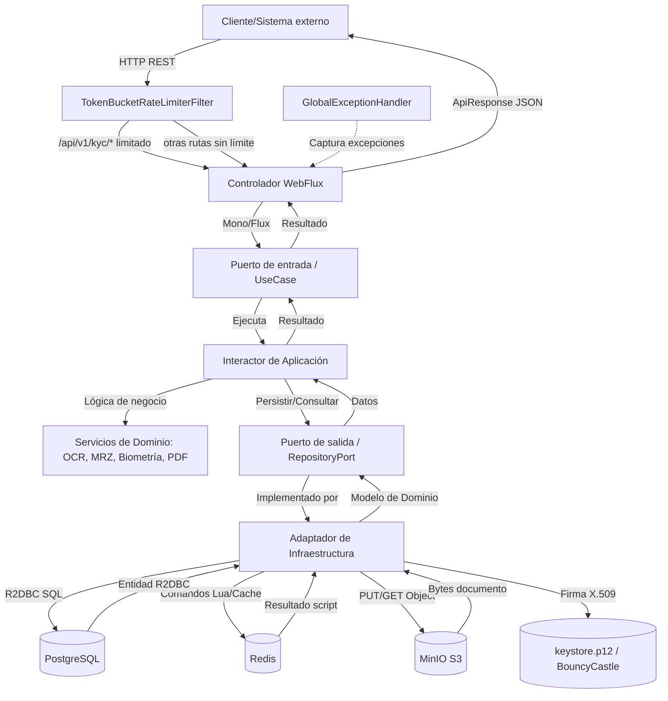

# Arquitectura y Distribución de Componentes del Proyecto

## Arquitectura de Alto Nivel

- **Paradigma**: Arquitectura Hexagonal (Puertos y Adaptadores) sobre un microservicio reactivo.
- **Stack Tecnológico Central**: Java 21 / Spring Boot 3.2.5 / Spring WebFlux (reactivo, no bloqueante).
- **Distribución del Código Fuente** (`src/main/java/com/aegis/sign/`):
  - `domain/`: Lógica de dominio pura, sin dependencias de frameworks de infraestructura.
    - `model/`: Entidades de dominio (`Contract`, `KycSession`, `Signature`, `AuditTrail`, `MatchResult`).
    - `port/`: Interfaces de puertos de salida (repositorios, almacenamiento, cifrado, firma).
    - `service/`: Servicios de dominio con lógica de negocio (OCR, MRZ, biometría, compilación de PDF, plantillas).
    - `exception/`: Excepciones de dominio (`KycUserException`, `KycTechnicalException`, `ResourceNotFoundException`, `TemplateNotFoundException`, `PersistenceSerializationException`).
  - `application/`: Casos de uso y puertos de entrada.
    - `ports/in/`: Interfaces de los casos de uso (`ContractUseCase`, `KycUseCase`, `SignatureUseCase`).
    - `usecase/`: Implementaciones de los casos de uso (`ContractInteractor`, `KycInteractor`, `SignatureInteractor`).
  - `infrastructure/`: Adaptadores externos.
    - `adapter/web/`: Controladores REST WebFlux, filtros, manejador global de excepciones.
    - `adapter/db/`: Adaptadores de persistencia R2DBC (entidades, repositorios Spring Data, adaptadores de mapeo dominio↔entidad).
    - `adapter/storage/`: Adaptador MinIO (S3 API).
    - `adapter/redis/`: Helper de caché de sesión sobre Redis reactivo.
    - `adapter/signature/`: Adaptador de firma digital con BouncyCastle y OpenPDF.
    - `adapter/keystore/`: Adaptador de cifrado simétrico AES-GCM (no usa un KeyStore real pese al nombre del paquete; ver `notes/memory.md`).
    - `config/`: Configuración de beans (MinIO, R2DBC, Tesseract, WebFlux).
    - `worker/`: Tareas programadas (`StoragePurgeWorker`).
  - `AegisSignApplication.java`: Punto de entrada Spring Boot (`@EnableScheduling`).
  - `src/main/resources/`: `application.yml`, migraciones Flyway (`db/migration/`), plantillas JSON de contrato (`templates/`), plantilla de audit trail (`audit-trail-template.json`), script Lua de rate limiting (`scripts/rate_limit.lua`), keystore PKCS12 de ejemplo (`keystore.p12`).

## Capas del Componente

### 1. Capa de Presentación (API REST)

- **Cliente**: El microservicio expone una API REST consumida por sistemas externos (no incluye frontend).
- **Tecnología**: Spring WebFlux con controladores anotados (`@RestController`).
- **Controladores**:
  - `ContractController` (`/api/v1/contracts`): creación y consulta de contratos.
  - `KycController` (`/api/v1/kyc/sessions`): ciclo de vida de sesiones KYC, subida de documento de identidad y biometría (multipart).
  - `SignatureController` (`/api/v1/signatures`): preparación de hash, firma de contrato, consulta/listado de firmas, generación de PDF de audit trail firmado.
- **Filtros**: `TokenBucketRateLimiterFilter` (WebFilter) aplica limitación de tasa basada en script Lua de Redis (Token Bucket), restringido a rutas `/api/v1/kyc/*`.
- **Manejo de errores**: `GlobalExceptionHandler` (`@RestControllerAdvice`) traduce excepciones de dominio a respuestas HTTP estandarizadas (`ApiResponse<T>`). Nota: `PersistenceSerializationException` NO tiene handler dedicado — cae en el handler genérico `Exception.class` y responde 500 (ver `notes/memory.md`).
- **Formato de respuesta**: `ApiResponse<T>` (success, data, message, errorCode, timestamp).

### 2. Capa de Negocio (Application + Domain)

- **Casos de uso / Interactores**: `ContractInteractor`, `KycInteractor`, `SignatureInteractor` implementan los puertos de entrada y orquestan servicios de dominio y puertos de salida.
- **Validación de dominio**: Reglas de negocio embebidas en entidades (`Contract.markAsSigned()`, `KycSession.approve()/reject()`) y en servicios de dominio dedicados.
- **Servicios de dominio**:
  - `OcrExtractorService`: extracción OCR vía Tess4j/Tesseract, detección y parseo de zonas MRZ (TD1/TD2/TD3).
  - `MrzValidationService`: cálculo y verificación de checksums ICAO Doc 9303.
  - `BiometricValidationService`: validación de calidad de imagen (resolución, contraste), detección de rostro (mock) y liveness (mock).
  - `BiometricMatchingService`: comparación facial 1:1 vía ONNX Runtime (si existe modelo en `biometrics.model-path`) con fallback a similitud simulada determinística.
  - `PdfTemplateCompiler`: compila plantillas JSON a PDF (OpenPDF) y calcula hash SHA-256 del contenido.
  - `TemplateResolver`: resuelve y cachea plantillas JSON de `classpath:templates/`.
- **Coordinación**: Orquestación 100% reactiva (Mono/Flux) entre interactor → servicio de dominio → puerto de salida → adaptador de infraestructura.

### 3. Capa de Datos/Persistencia

- **Patrón de acceso a datos**: Repository Pattern vía puertos de salida (`*RepositoryPort`) implementados por adaptadores (`*RepositoryAdapter`) que envuelven repositorios Spring Data R2DBC (`ReactiveCrudRepository`).
- **ORM/Driver**: Spring Data R2DBC + driver `r2dbc-postgresql` (reactivo, no bloqueante) para PostgreSQL.
- **Gestión de esquema**: Flyway (migraciones SQL versionadas en `src/main/resources/db/migration/`, ejecutadas vía conexión JDBC separada — Flyway no soporta R2DBC directamente).
- **Mapeo de columnas JSONB**: Tipo `io.r2dbc.postgresql.codec.Json`, serializado/deserializado manualmente con Jackson `ObjectMapper` dentro de cada adaptador (no hay conversión automática de objetos complejos; un `R2dbcCustomConversions` solo convierte `Json` → `String`).
- **Otros almacenes**:
  - **Redis** (reactivo): caché de sesión (`RedisSessionCacheHelper`, actualmente sin consumidores activos en el código de producción) y contador del rate limiter (Token Bucket vía Lua script).
  - **MinIO** (S3 API): almacenamiento de objetos para documentos de contrato firmados, documentos de identidad temporales, biometría temporal y PDFs de audit trail. Dos buckets: `minio.bucket` (permanente) y `minio.temp-bucket` (temporal, sujeto a purga GDPR).

## Ciclo de Vida Completo de Solicitud/Datos

## Puntos de Integración del Sistema

- **Módulos internos**:
  - **Módulo KYC**: subida de documento de identidad → OCR local (Tess4j) → validación MRZ (ICAO Doc 9303) → subida de biometría → validación de calidad/liveness → comparación facial 1:1 (ONNX) → aprobación/rechazo de sesión.
  - **Módulo de Contratos**: resolución de plantilla JSON → compilación a PDF (OpenPDF) → cálculo de hash SHA-256 → subida a MinIO → persistencia de metadatos.
  - **Módulo de Firma**: preparación de hash → verificación de sesión KYC aprobada → cifrado de huella de certificado (AES-GCM) → firma criptográfica (BouncyCastle, `SHA256withRSA`) → registro de `Signature` → actualización de estado del `Contract` → consolidación de `AuditTrail`.
  - **Generación de Audit Trail PDF**: compila plantilla `audit-trail-template.json` con los datos del `AuditTrail`, firma el PDF resultante con `PdfStamper`/`PdfSignatureAppearance` (firma criptográfica embebida en el propio PDF, distinta de la firma de hash) y sube el resultado a MinIO actualizando `final_signed_pdf_uri`.
  - **Worker de purga GDPR**: `StoragePurgeWorker`, tarea programada (`@Scheduled`, cron configurable, por defecto diario a las 02:00) que elimina archivos temporales de MinIO más antiguos que `storage.purge.retention-days` (7 días por defecto). Solo opera sobre el bucket temporal (`minio.temp-bucket`), no sobre el bucket permanente.
- **Servicios externos / Adaptadores de infraestructura**:
  - **PostgreSQL** (vía R2DBC): almacenamiento reactivo de `kyc_sessions`, `contracts`, `signatures`, `audit_trails`.
  - **Redis** (reactivo): backend del rate limiter Token Bucket (Lua script) y helper de caché de sesión (sin uso productivo confirmado actualmente).
  - **MinIO** (S3 API): almacenamiento de objetos (documentos, biometría, PDFs firmados).
  - **Tesseract OCR** (vía Tess4j, nativo): requiere librerías nativas del sistema (`libtesseract`, `libleptonica`) y `tessdata` configurado en `tesseract.datapath`.
  - **ONNX Runtime**: motor de inferencia para el modelo de embeddings faciales (`biometrics.model-path`); si el archivo del modelo no existe en el classpath/filesystem, el servicio cae a una similitud simulada determinística basada en el tamaño de las imágenes (sin matching real).
  - **HashiCorp Vault** (vía Spring Cloud Vault Config): fuente de secretos en tiempo de arranque (`spring.config.import: vault://`), reemplaza variables como `db.username`, `db.password`, `minio.access-key`, `minio.secret-key`, `keystore.password`, `keystore.key-password`.
  - **Zipkin / Micrometer Tracing (Brave)**: trazas distribuidas exportadas a `http://localhost:9411` por defecto.
  - **Prometheus** (vía Micrometer): métricas expuestas en `/actuator/prometheus`.

---

### Contexto y Navegación

- [CLAUDE.md](../CLAUDE.md)
- [business_logic.md](business_logic.md)
- [database.md](database.md)
