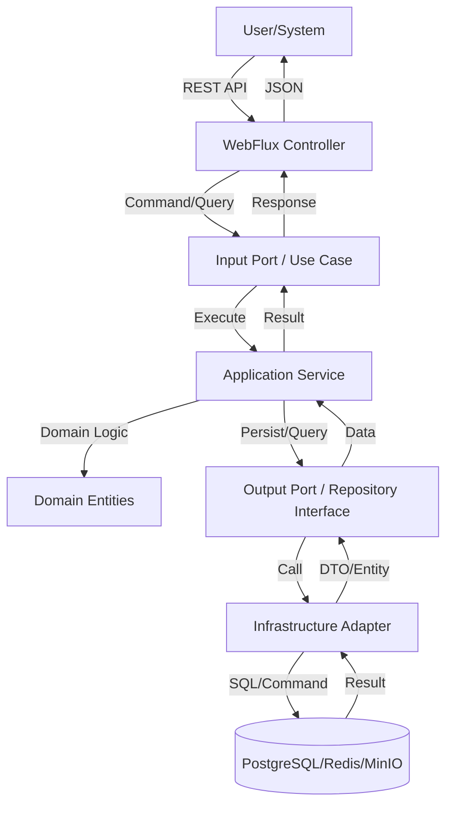

# Project Architecture & Component Distribution

## High-Level Architecture
- **Paradigm**: Microservices / Hexagonal Architecture (Ports and Adapters).
- **Core Technology Stack**: Java 21 / Spring Boot 3.x / Spring WebFlux (Reactive).
- **Source Code Distribution**:
  - `src/main/java/com/aegis/sign/domain`: Pure Domain Logic (Entities, Rules, Value Objects).
  - `src/main/java/com/aegis/sign/application`: Use Cases and Ports (Input/Output interfaces).
  - `src/main/java/com/aegis/sign/infrastructure`: External Adapters (REST, PostgreSQL, Redis, MinIO, PKI).
  - `src/main/resources`: Configuration (application.yml) and Database Migrations.

## Component Layers
### 1. Presentation Layer (UI/Interface)
- **Client/Web**: The microservice exposes a REST API. A separate frontend (not in this repo) is expected to consume it.
- **Technology**: Spring WebFlux (REST Controllers).
- **Static Assets**: None (API-only service).

### 2. Business Layer (Logic)
- **Services/Controllers**: Application Services implement the Use Cases defined in the ports.
- **Validation**: Domain-level validation within Entities and Value Objects.
- **Coordination**: Reactive orchestration of KYC and Signature flows.

### 3. Data/Persistence Layer
- **Data Access Pattern**: Repository Pattern (Output Ports).
- **ORM/Driver**: R2DBC (Reactive Relational Database Connectivity) for PostgreSQL.
- **Schema Management**: Flyway or Liquibase (intended).

## Full Request/Data Lifecycle

## System Integration Points
- **Internal Modules**: 
    - **KYC Module**: Handles document upload and identity verification session lifecycle.
    - **Signature Module**: Manages pre-signature hashing, PAdES-compliant digital signing (simulated), and audit trail consolidation.
    - **Template Compilation**: Compiles JSON templates containing text elements/variables into PDF documents using OpenPDF (packaged in `PdfTemplateCompiler`).
- **External Services (Infrastructure Adapters)**:
    - **PostgreSQL (R2DBC)**: Reactive storage for `kyc_sessions`, `contracts`, `signatures`, and `audit_trails`.
    - **Redis**: Reactive cache client setup and configured (though the rate-limiter currently operates in-memory).
    - **MinIO (S3 API)**: Object storage for input documents and generated PDFs, leveraging elastic scheduler for non-blocking operations.
    - **OCR & Biometrics Services**: Encapsulated within the domain layer as OCR MRZ validators and Biometric Matchers with standard checking algorithms and localized mock-engines.
    - **PKI Adapter**: Interfaces with internal certificate management to verify and apply digital signatures.

---

### Context & Navigation
- [GEMINI.md](../../GEMINI.md)
- [business_logic.md](business_logic.md)
- [database.md](database.md)
