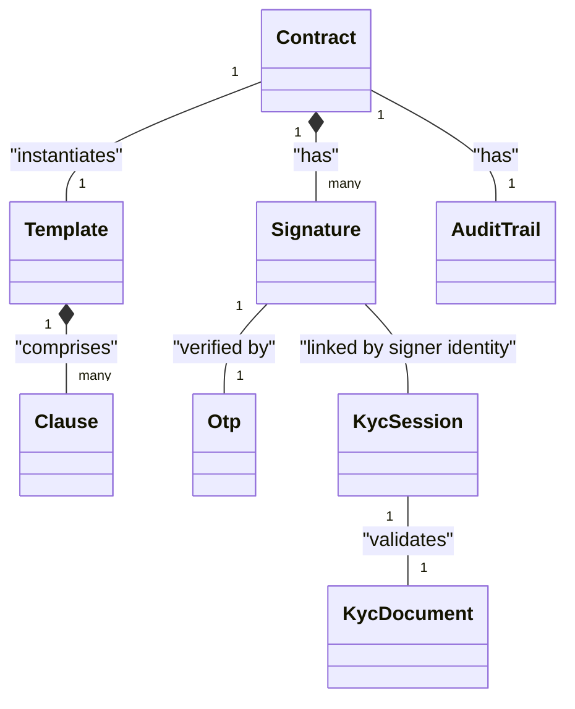

# Business Logic & Core Domain Objects (EXHAUSTIVE)

## Domain Glossary & Business Logic Units
| Business Concept | Technical Component | Description |
|------------------|---------------------|-------------|
| KYC (Know Your Customer) | KycModule | Identity verification process including OCR and Biometrics. |
| FEA (Advanced Electronic Signature) | SignatureModule | Criptographic signing of documents with legal validity. |
| Audit Trail | AuditTrailService | Immutable record of all events related to a signature. |
| PKI (Public Key Infrastructure) | PkiAdapter | Management of X.509 certificates and keys for signing. |
| Modular Contract | TemplateModule | Assembly of contracts from reusable clauses. |

## Full Domain Object / Model Inventory
| Object Name | Description / Business Role | Fields / State | Parent/Related Objects | Persistence / Source |
|-------------|-----------------------------|----------------|------------------------|----------------------|
| KycSession  | Temporary session for identity verification. | id, status, documentMetadata, faceMatchScore | KycDocument, Biometrics | Redis (Temporary) |
| KycDocument | Extracted data from identity document. | firstName, lastName, docNumber, birthDate, mrz | KycSession | PostgreSQL / MinIO |
| Contract    | Document to be signed. | id, contentHash, status, uri, templateId | Signature, AuditTrail, Template | PostgreSQL / MinIO |
| Template    | Blueprint for a contract. | id, name, version, layoutMetadata | Clause, Contract | PostgreSQL |
| Clause      | Reusable legal fragment. | id, content, variables (JSON) | Template | PostgreSQL |
| Signature   | Digital signature applied to a contract. | id, signerId, timestamp, hash, certificateThumbprint | Contract | PostgreSQL |
| Otp         | One-Time Password for consent. | id, code, expiry, destination (Phone/Email) | Signature | Redis (Temporary) |
| AuditTrail  | Complete log of a contract's lifecycle. | id, contractId, events (JSON) | Contract | PostgreSQL |

## Object Relationship Diagram

## Fundamental Business Rules
1. **Identity Pre-requisite**: A contract cannot be signed unless the signer has a valid and approved KYC session.
2. **Template Versioning**: Contracts must be generated from the specific version of a template approved at that time.
3. **Document Immutability**: Once a contract is hashed and prepared for signature, its content cannot be modified.
4. **Consent Verification**: Signature is only valid if the OTP sent to the verified user has been correctly validated.
5. **Audit Completeness**: Every state transition (from KYC start to final signature) must be recorded in the Audit Trail with a high-precision timestamp and IP.
6. **Anti-Spoofing**: Biometric validation must pass a liveness check to prevent fraud.

## Complex Functional Flows
### KYC Lifecycle
- **Starting Point**: User requests a new KYC session via `/api/v1/kyc/sessions`.
- **Transformation Steps**: 
    1. Upload Identity Document (OCR extraction via Tesseract/PDFBox).
    2. Upload Selfie (Biometric comparison via OpenCV).
    3. Decision Engine validates results.
- **Ending Point**: Session marked as `APPROVED` or `REJECTED`.

### Contract Preparation
- **Starting Point**: API request with template ID and variable values.
- **Transformation Steps**:
    1. Fetch Template and associated Clauses.
    2. Inject variables into Clauses.
    3. Render final PDF via Template Engine.
    4. Store in MinIO and generate SHA-256 hash.
- **Ending Point**: `Contract` object created in `PREPARED` state.

### Signature & Consent
- **Starting Point**: User requests to sign a `PREPARED` contract.
- **Transformation Steps**:
    1. Generate and send OTP to the user's verified contact.
    2. User submits OTP.
    3. If OTP valid, apply X.509 digital signature (PAdES).
    4. Update Audit Trail with consent evidence.
- **Ending Point**: Contract marked as `SIGNED`.

---

### Context & Navigation
- [GEMINI.md](../GEMINI.md)
- [architecture.md](architecture.md)
- [database.md](database.md)
