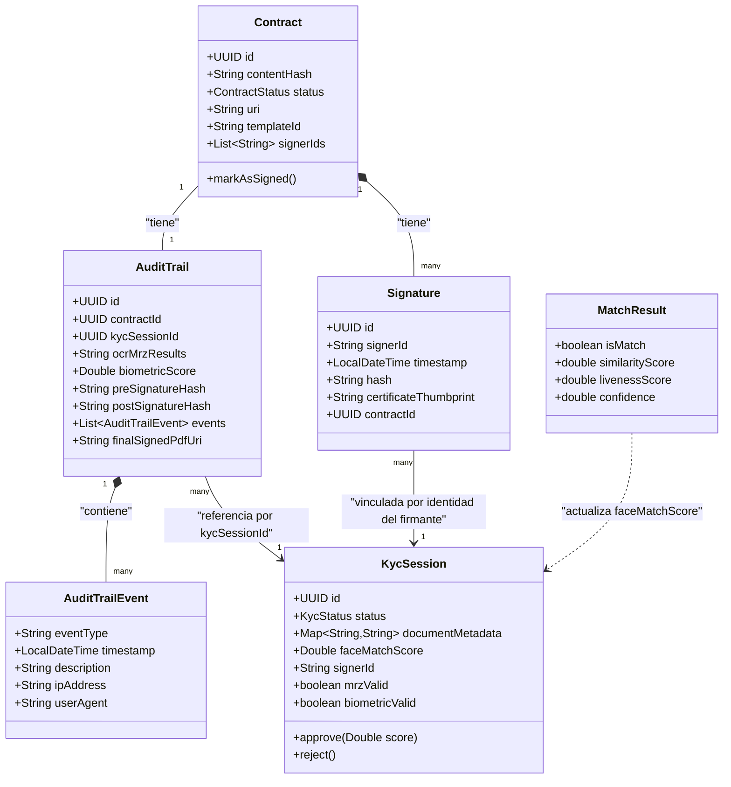

# Lógica de Negocio y Objetos de Dominio Centrales (EXHAUSTIVO)

## Glosario de Negocio y Unidades de Lógica

| Concepto de Negocio | Componente Técnico | Descripción |
|----------------------|---------------------|-------------|
| KYC (Know Your Customer) | `KycUseCase` / `KycInteractor` | Proceso de verificación de identidad: OCR, validación MRZ y biometría. |
| FEA (Firma Electrónica Avanzada) | `SignatureUseCase` / `SignatureInteractor` | Firma criptográfica de documentos con validez legal mediante certificado X.509. |
| Audit Trail | `AuditTrailRepositoryPort` / `AuditTrail` | Registro inmutable y consolidado de todos los eventos asociados a un contrato (KYC + firma). |
| PKI (Infraestructura de Clave Pública) | `SignatureServiceAdapter` | Gestión de certificados X.509 y claves privadas (PKCS12) para firmar contenido y PDFs. |
| Contrato Modular | `TemplateResolver` / `PdfTemplateCompiler` | Ensamblaje de contratos en PDF a partir de plantillas JSON reutilizables con sustitución de variables `{{var}}`. |
| MRZ (Machine Readable Zone) | `MrzValidationService` / `OcrExtractorService` | Zona de lectura mecánica de documentos de identidad (pasaportes/DNI), validada según ICAO Doc 9303. |
| Match Biométrico 1:1 | `BiometricMatchingService` | Comparación de similitud facial entre el rostro del documento y la selfie del usuario. |
| Liveness (prueba de vida) | `BiometricValidationService` / `BiometricMatchingService` | Verificación de que la biometría proviene de una persona viva y no de una foto/estática (actualmente simulada/mock). |

## Inventario Completo de Objetos de Dominio / Modelos

> Inventario exhaustivo de las 5 clases en `src/main/java/com/aegis/sign/domain/model/`.

| Objeto | Descripción / Rol de Negocio | Campos / Estado | Objetos Relacionados | Persistencia / Origen |
|--------|-------------------------------|------------------|------------------------|------------------------|
| `Contract` | Documento a firmar; representa el ciclo de vida completo de un contrato. | `id` (UUID), `contentHash` (String, SHA-256), `status` (enum `ContractStatus`), `uri` (String, ubicación en MinIO), `templateId` (String), `signerIds` (List\<String\>) | `Signature` (1\:N), `AuditTrail` (1:1) | Tabla `contracts` vía `ContractEntity` / `ContractRepositoryAdapter` |
| `Contract.ContractStatus` (enum interno) | Estados del ciclo de vida del contrato. | `DRAFT, PREPARED, PENDING_SIGNATURE, SIGNED, CANCELLED, EXPIRED, REVOKED` | — | Columna `contracts.status` (VARCHAR, sin CHECK que valide estos 7 valores tras V1, ver `notes/memory.md`) |
| `KycSession` | Sesión efímera de verificación de identidad de un firmante. | `id` (UUID), `status` (enum `KycStatus`), `documentMetadata` (Map\<String,String\>), `faceMatchScore` (Double), `signerId` (String), `mrzValid` (boolean, default false), `mrzValidationErrorMessage` (String), `biometricValid` (boolean, default false), `biometricValidationErrorMessage` (String) | Referenciada por `AuditTrail.kycSessionId`; insumo de `SignatureInteractor.signContract` | Tabla `kyc_sessions` vía `KycSessionEntity` / `KycRepositoryAdapter` |
| `KycSession.KycStatus` (enum interno) | Estados de la sesión KYC. | `PENDING_DOCUMENTS, PROCESSING, MANUAL_REVIEW, APPROVED, REJECTED, MRZ_FAILED, BIOMETRIC_FAILED` | — | Persistido como `FAILED` en BD para `MRZ_FAILED`/`BIOMETRIC_FAILED` (colapso de estado, ver `notes/memory.md`); reconstruido en dominio usando `mrzValid`/`biometricValid` |
| `Signature` | Detalle de una firma electrónica aplicada a un contrato. | `id` (UUID), `signerId` (String), `timestamp` (LocalDateTime), `hash` (String, resultado de la firma criptográfica), `certificateThumbprint` (String, cifrado con AES-GCM antes de persistir), `contractId` (UUID) | `Contract` (N:1) | Tabla `signatures` vía `SignatureEntity` / `SignatureRepositoryAdapter` |
| `AuditTrail` | Registro legal inmutable que consolida evidencias de KYC y firma para un contrato. | `id` (UUID), `contractId` (UUID), `kycSessionId` (UUID), `ocrMrzResults` (String, texto libre con resultados MRZ), `biometricScore` (Double), `preSignatureHash` (String), `postSignatureHash` (String), `events` (List\<`AuditTrailEvent`\>), `finalSignedPdfUri` (String, URI del PDF de audit trail firmado en MinIO, null hasta que se genera) | `Contract` (1:1), `KycSession` (N:1) | Tabla `audit_trails` vía `AuditTrailEntity` / `AuditTrailRepositoryAdapter` |
| `AuditTrail.AuditTrailEvent` (clase estática anidada) | Evento individual dentro de la traza de auditoría. | `eventType` (String, ej. "SIGNATURE"), `timestamp` (LocalDateTime), `description` (String), `ipAddress` (String), `userAgent` (String) | Contenido dentro de `AuditTrail.events`, serializado en la columna JSONB `trail_manifest` | No tiene tabla propia; vive embebido en `audit_trails.trail_manifest` |
| `MatchResult` | Resultado de la comparación biométrica 1:1 entre rostro de documento y selfie. | `isMatch` (boolean, final), `similarityScore` (double, final), `livenessScore` (double, final), `confidence` (double, final, promedio de similarity y liveness) | Producido por `BiometricMatchingService`, consumido por `KycInteractor.handleFaceMatchResult` | Objeto transitorio, no persistido directamente; sus valores se vuelcan a `KycSession.faceMatchScore` y a `documentMetadata` |

## Diagrama de Relaciones entre Objetos

## Reglas de Negocio Fundamentales

1. **Prerrequisito de identidad verificada**: Un contrato solo puede firmarse si el firmante posee una `KycSession` localizable por `kycSessionId` (`SignatureInteractor.signContract` recupera la sesión vía `kycRepositoryPort.findById`); el flujo no impone explícitamente en código que el estado deba ser `APPROVED` antes de firmar (riesgo documentado en `notes/memory.md`).
2. **Inmutabilidad del documento**: Una vez calculado el `contentHash` (SHA-256) del contrato durante `createContract`, el contenido no se vuelve a recompilar; la firma opera sobre ese hash congelado (`preSignatureHash`).
3. **Unicidad de la firma por estado**: `Contract.markAsSigned()` lanza `IllegalStateException` si el contrato ya está en estado `SIGNED`, evitando doble firma a nivel de invariante de dominio (aunque `SignatureInteractor.signContract` actualmente asigna el estado `SIGNED` directamente con `contract.setStatus(...)` sin invocar este método).
4. **Consentimiento y trazabilidad**: Toda transición relevante del flujo de firma se registra como `AuditTrailEvent` con marca de tiempo, IP y User-Agent del solicitante (capturados en `SignatureController.sign`).
5. **Validación MRZ obligatoria**: La subida de un documento de identidad (`submitIdDocument`) exige que el OCR detecte una zona MRZ válida (TD1/TD2/TD3) y que todos los checksums ICAO Doc 9303 sean correctos; si falla, la sesión pasa a `MRZ_FAILED` y se lanza `KycUserException("UNREADABLE_MRZ")`.
6. **Validación de calidad biométrica**: La selfie debe cumplir resolución mínima (480×480), contraste mínimo (10.0), detección de rostro y liveness mínimo (0.6) antes de proceder al matching 1:1; cualquier fallo marca la sesión como `BIOMETRIC_FAILED`.
7. **Umbral de coincidencia facial**: El matching 1:1 solo se considera positivo (`isMatch = true`) si `similarityScore >= biometrics.match-threshold` (0.8 por defecto); de lo contrario, `KycUserException("FACE_MATCH_FAILED")`.
8. **Cifrado de huella de certificado**: El `certificateThumbprint` recibido en la solicitud de firma se cifra con AES-256-GCM (`EncryptionPort`/`SoftwareKeyStoreEncryptionAdapter`) antes de persistirse en `Signature.certificateThumbprint`.
9. **Falla rápida en (de)serialización**: Cualquier error al serializar/deserializar payloads JSONB (manifiesto de audit trail, `signerIds`, datos extraídos de KYC) lanza `PersistenceSerializationException` y aborta la cadena reactiva, en lugar de persistir/devolver un registro corrupto o incompleto.
10. **GDPR / Purga de temporales**: Cualquier archivo (documento de identidad, biometría) subido al bucket temporal de MinIO se elimina automáticamente tras `storage.purge.retention-days` días (7 por defecto), ejecutado por `StoragePurgeWorker` cada día a las 02:00 (cron configurable).

## Flujos Funcionales Complejos

### Flujo 1: Ciclo de Vida KYC

- **Punto de partida**: `POST /api/v1/kyc/sessions?signerId={signerId}` crea una `KycSession` en estado `PENDING_DOCUMENTS`.
- **Pasos de transformación**:
  1. **Subida de documento de identidad** (`POST /api/v1/kyc/sessions/{id}/documents`, multipart):
     - `OcrExtractorService.extractData` ejecuta OCR local con Tess4j sobre la imagen.
     - Detección del tipo de MRZ (TD1/TD2/TD3) por expresiones regulares sobre las líneas de texto reconocidas.
     - `MrzValidationService.validateChecksum` verifica cada campo (número de documento, fecha de nacimiento, fecha de expiración, número personal opcional) y el checksum compuesto según ICAO Doc 9303.
     - Si la validación falla: estado → `MRZ_FAILED`, se persiste la sesión y se lanza `KycUserException`.
     - Si es válida: el documento se sube al bucket temporal de MinIO (`documents/{sessionId}/id`) y se guarda la ruta en `documentMetadata`.
  2. **Subida de biometría** (`POST /api/v1/kyc/sessions/{id}/biometrics`, multipart):
     - `BiometricValidationService.validate` comprueba resolución, contraste, detección de rostro (mock) y liveness (mock).
     - Si falla cualquier check: estado → `BIOMETRIC_FAILED`.
     - Si pasa: se descarga el documento de identidad ya almacenado y se ejecuta `BiometricMatchingService.match` (1:1) contra la selfie recién subida.
     - Si el match falla (`similarityScore < threshold`): estado → `BIOMETRIC_FAILED`, `KycUserException("FACE_MATCH_FAILED")`.
     - Si el match es exitoso: la selfie se sube al bucket temporal y se actualizan `faceMatchScore` y metadatos.
  3. **Verificación de sesión** (`verifySession`, expuesta en el puerto de entrada pero sin endpoint REST mapeado en `KycController`): actualmente simula aprobación automática (`status = APPROVED`) sin lógica de revisión real (deuda técnica, ver `notes/memory.md`).
- **Punto final**: Sesión en estado `APPROVED`, `REJECTED`, `MRZ_FAILED` o `BIOMETRIC_FAILED`.

### Flujo 2: Preparación y Hashing de Contrato

- **Punto de partida**: `POST /api/v1/contracts` con `templateId`, `signerIds` y `data` (variables a sustituir en la plantilla).
- **Pasos de transformación**:
  1. `TemplateResolver.resolve(templateId)` carga (y cachea) la plantilla JSON desde `classpath:templates/{templateId}.json`; lanza `TemplateNotFoundException` si no existe.
  2. `PdfTemplateCompiler.compile` sustituye variables `{{var}}` y genera el PDF (OpenPDF) con elementos `header`/`paragraph`.
  3. `PdfTemplateCompiler.calculateHash` calcula el SHA-256 del PDF generado.
  4. El PDF se sube a MinIO (`contracts/{contractId}.pdf`) en el bucket permanente.
  5. Se persiste el `Contract` con estado `PREPARED`.
- **Punto final**: Contrato creado, hash disponible vía `GET /api/v1/signatures/prepare?contractId=...` o consultando el contrato directamente.

### Flujo 3: Firma y Consentimiento

- **Punto de partida**: `POST /api/v1/signatures/sign` con `SignRequest` (`contractId`, `kycSessionId`, `signerId`, `certificateThumbprint`).
- **Pasos de transformación**:
  1. Recuperar el `Contract` por `contractId`.
  2. En paralelo (`Mono.zip`): cifrar `certificateThumbprint` (AES-GCM) y recuperar la `KycSession` por `kycSessionId`.
  3. `SignatureServiceAdapter.sign` firma el `preSignatureHash` (contentHash del contrato) usando `SHA256withRSA` con la clave privada cargada del KeyStore PKCS12 (BouncyCastle como proveedor JCA).
  4. Se construye el objeto `Signature` con el hash firmado (`postSignatureHash`) y la huella cifrada.
  5. El `Contract` se marca como `SIGNED`.
  6. Se construye un `AuditTrailEvent` tipo `SIGNATURE` con IP y User-Agent de la solicitud HTTP.
  7. Se construye y persiste el `AuditTrail` consolidando: resultados OCR/MRZ (texto), `biometricScore`, `preSignatureHash`, `postSignatureHash` y el evento.
  8. Se persisten en cadena: `Signature` → `Contract` actualizado → `AuditTrail`.
- **Punto final**: `Contract.status = SIGNED`, objeto `Signature` devuelto al cliente.

### Flujo 4: Generación y Firma del PDF de Audit Trail

- **Punto de partida**: `GET /api/v1/signatures/audit-trail/{contractId}`.
- **Pasos de transformación**:
  1. Se busca el `AuditTrail` por `contractId`; si no existe, `ResourceNotFoundException`.
  2. Se carga la plantilla `audit-trail-template.json` y se rellena con los datos del audit trail (IDs, resultados OCR/MRZ, score biométrico, hashes, lista de eventos formateada como texto).
  3. `PdfTemplateCompiler.compile` genera el PDF sin firmar.
  4. `SignatureServiceAdapter.signPdf` aplica una firma criptográfica embebida en el propio PDF (`PdfStamper`/`PdfSignatureAppearance`, modo `SELF_SIGNED`, razón "Electronic Signature").
  5. El PDF firmado se sube a MinIO (`audit-trails/{contractId}-audit-trail.pdf`).
  6. Se actualiza `audit_trails.final_signed_pdf_uri` mediante una consulta `UPDATE` dedicada (`AuditTrailRepository.updateFinalSignedPdfUri`).
- **Punto final**: PDF firmado devuelto como `application/pdf` al cliente; URI persistida para referencia futura.

---

### Contexto y Navegación

- [CLAUDE.md](../CLAUDE.md)
- [architecture.md](architecture.md)
- [database.md](database.md)
