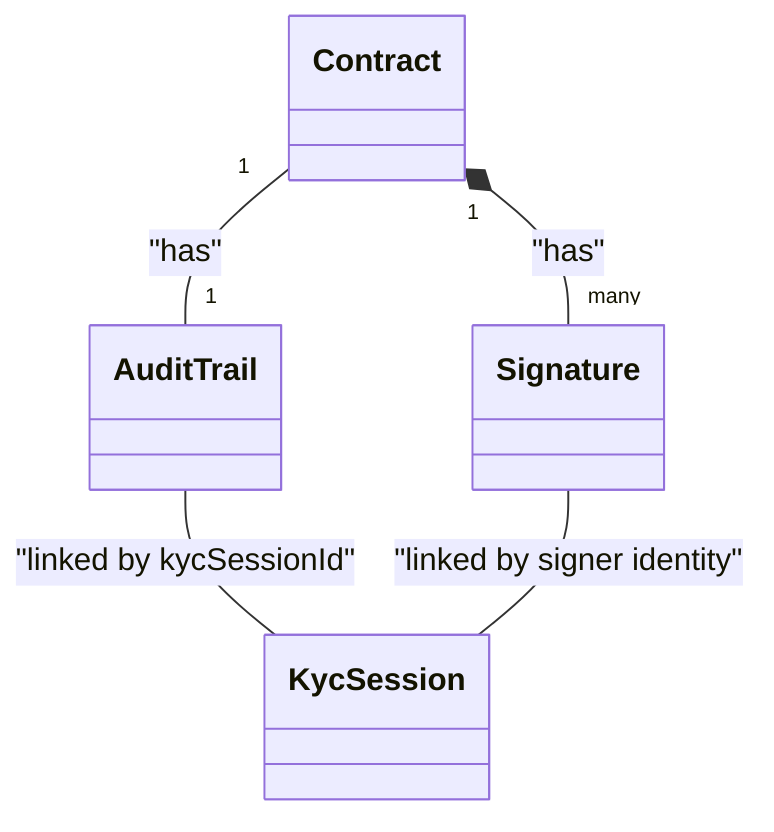

# Business Logic & Core Domain Objects (EXHAUSTIVE)

## Domain Glossary & Business Logic Units
| Business Concept | Technical Component | Description |
|------------------|---------------------|-------------|
| KYC (Know Your Customer) | KycModule | Identity verification process including OCR and Biometrics. |
| FEA (Advanced Electronic Signature) | SignatureModule | Criptographic signing of documents with legal validity. |
| Audit Trail | AuditTrailService | Immutable record of all events related to a signature. |
| PKI (Public Key Infrastructure) | PkiAdapter | Management of X.509 certificates and keys for signing. |
| Modular Contract | TemplateModule | Assembly of contracts from reusable clauses. |

## Full Domain Object / Model Inventory
| Object Name | Description / Business Role | Fields / State | Parent/Related Objects | Persistence / Source |
|-------------|-----------------------------|----------------|------------------------|----------------------|
| KycSession  | Ephemeral session for identity verification. | id, status, documentMetadata, faceMatchScore, signerId | AuditTrail | PostgreSQL / Redis (Configured) |
| Contract    | Document to be signed. | id, contentHash, status, uri, templateId | Signature, AuditTrail | PostgreSQL |
| Signature   | Digital signature details. | id, contractId, signerId, hash, certificateThumbprint, timestamp | Contract | PostgreSQL |
| AuditTrail  | Immutable log of all events related to a contract. | id, contractId, kycSessionId, events, finalSignedPdfUri | Contract, KycSession | PostgreSQL |

## Object Relationship Diagram

## Fundamental Business Rules
1. **Identity Pre-requisite**: A contract cannot be signed unless the signer has a valid and approved KYC session.
2. **Document Immutability**: Once a contract is prepared for signature, its content cannot be modified.
3. **Consent & Verification**: Every state transition (from KYC start to final signature) must be recorded in the Audit Trail with a high-precision timestamp, IP, and User Agent.
4. **Anti-Spoofing & Validation**: Facial comparison score must meet a minimum matching threshold to approve a KYC session.

## Complex Functional Flows
### KYC Lifecycle
- **Starting Point**: Consumer application initiates a new KYC session for a signer via `/api/v1/kyc/sessions?signerId={signerId}`.
- **Transformation Steps**: 
    1. **Upload Identity Document**: 
        - Local OCR extraction using **Tess4j (Tesseract)**.
        - **MRZ Validation**: Checksum calculation (ICAO Doc 9303) for Document Number, DOB, Expiry, and Composite fields (TD1, TD2, TD3).
        - Status set to `MRZ_FAILED` if checksums do not match.
    2. **Upload Biometrics**: 
        - Quality analysis (contrast, resolution) and face detection.
        - Liveness check (mocked logic for frames analysis).
        - Storage of biometric data in temporary MinIO bucket.
    3. **Session Verification**: 
        - Manual or automated final approval.
- **Ending Point**: Session marked as `APPROVED`, `REJECTED`, `MRZ_FAILED`, or `BIOMETRIC_FAILED`.

### Contract Preparation & Hashing
- **Starting Point**: A contract has been populated and saved to the database.
- **Transformation Steps**:
    1. API consumer calls `/api/v1/signatures/prepare?contractId={contractId}`.
    2. System calculates the **SHA-256 hash** of the PDF content.
- **Ending Point**: Contract prepared and hash returned to the client.

### Signature & Consent
- **Starting Point**: User invokes `/api/v1/signatures/sign` with `SignRequest`.
- **Transformation Steps**:
    1. Retrieve the prepared contract and verify its hash.
    2. Verify signer has an `APPROVED` KYC session.
    3. Apply **Advanced Electronic Signature (FEA)** using **X.509** certificate (`SHA256withRSA`).
    4. Records the encrypted certificate thumbprint for traceability.
    5. Compile the **Audit Trail** record in the database.
- **Ending Point**: Contract status updated to `SIGNED` and Signature object returned.

---

### Context & Navigation
- [GEMINI.md](../GEMINI.md)
- [architecture.md](architecture.md)
- [database.md](database.md)
