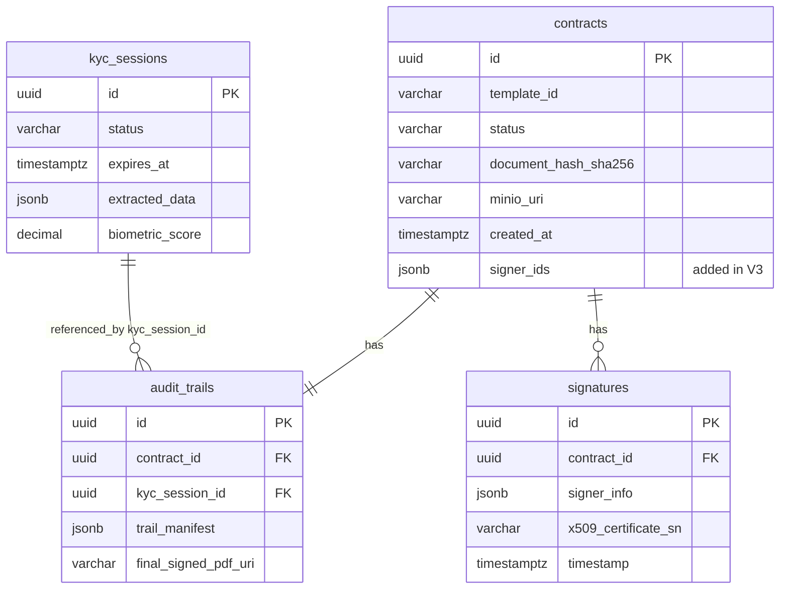

# Modelo de Datos y Acceso a Datos (EXHAUSTIVO)

## Capa de Acceso a Datos

- **Framework/Tecnología**: Spring Data R2DBC (Reactive Relational Database Connectivity) + driver `r2dbc-postgresql` para PostgreSQL.
- **Directorio base**: `src/main/java/com/aegis/sign/infrastructure/adapter/db/` (entidades en `entity/`, repositorios Spring Data en `repository/`, adaptadores de mapeo dominio↔entidad en la raíz del paquete `db/`).
- **Gestión de esquema**: Flyway (`flyway-core`), migraciones SQL versionadas en `src/main/resources/db/migration/`, ejecutadas vía conexión JDBC dedicada (`spring.flyway.url`), independiente de la conexión reactiva R2DBC usada en tiempo de ejecución.
- **Gestión de conexiones**: Pool R2DBC gestionado por Spring Boot (`spring.r2dbc.pool.max-size=10`, `initial-size=2`).
- **Conversión JSONB**: Tipo `io.r2dbc.postgresql.codec.Json` en las entidades; un `R2dbcCustomConversions` (`R2dbcConfig.JsonToStringConverter`) convierte `Json` → `String` en lectura, pero la serialización/deserialización a objetos de dominio (listas, mapas) se hace manualmente con Jackson `ObjectMapper` dentro de cada adaptador (`ContractRepositoryAdapter`, `KycRepositoryAdapter`, `AuditTrailRepositoryAdapter`).
- **Otros almacenes de datos** (fuera de R2DBC):
  - **Redis** (vía `spring-boot-starter-data-redis-reactive`): usado por `TokenBucketRateLimiterFilter` (contador de rate limiting mediante script Lua) y por `RedisSessionCacheHelper` (utilidad genérica get/put/delete con TTL; sin invocadores activos confirmados en el código de interactores actual).
  - **MinIO** (S3 API, no relacional): almacenamiento de blobs (PDFs de contrato, documentos de identidad, biometría, PDFs de audit trail firmados). No es una "tabla" pero forma parte del modelo de datos persistente del sistema.

## Diagrama Entidad-Relación (ERD)

## Inventario Completo de Estructuras de Datos

> 4 tablas relacionales (correspondientes 1:1 a las 4 clases en `infrastructure/adapter/db/entity/`), más 2 almacenes no relacionales (Redis, MinIO) documentados a continuación.

| Nombre (Tabla) | Descripción / Propósito | Campos clave (PK/FK/Índice) | Entidades relacionadas | Objeto de negocio / Entidad Java |
|------------------|--------------------------|-------------------------------|---------------------------|-----------------------------------|
| `kyc_sessions` | Almacena sesiones de verificación de identidad (KYC): estado, expiración, datos extraídos por OCR/MRZ y score biométrico. | PK: `id` (UUID, `gen_random_uuid()`); Índices: `idx_kyc_sessions_status`, `idx_kyc_sessions_expires_at` | Referenciada por `audit_trails.kyc_session_id` | `KycSession` (dominio) / `KycSessionEntity` |
| `contracts` | Gestiona el ciclo de vida y metadatos de los contratos a firmar, incluyendo hash de contenido y ubicación en MinIO. | PK: `id` (UUID); Índices: `idx_contracts_status`, `idx_contracts_template_id`, `idx_contracts_created_at` | `signatures` (1:N), `audit_trails` (1:1) | `Contract` (dominio) / `ContractEntity` |
| `signatures` | Registra cada evento de firma electrónica aplicado a un contrato. | PK: `id` (UUID); FK: `contract_id` → `contracts.id` (ON DELETE CASCADE); Índices: `idx_signatures_contract_id`, `idx_signatures_x509_certificate_sn` | `contracts` (N:1) | `Signature` (dominio) / `SignatureEntity` |
| `audit_trails` | Traza de evidencia legal inmutable que consolida los resultados de KYC y de la firma de un contrato. | PK: `id` (UUID); FK: `contract_id` → `contracts.id` (ON DELETE CASCADE), `kyc_session_id` → `kyc_sessions.id` (ON DELETE CASCADE); Índices: `idx_audit_trails_contract_id`, `idx_audit_trails_kyc_session_id` | `contracts` (1:1), `kyc_sessions` (N:1) | `AuditTrail` (dominio) / `AuditTrailEntity` |
| `kyc_sessions` (caché Redis) | Helper de caché reactivo genérico (`RedisSessionCacheHelper`) con soporte para guardar/leer cualquier valor serializado como JSON con TTL configurable. No hay evidencia en el código de interactores de que se utilice actualmente para cachear `KycSession` en producción. | Clave: string arbitraria (no necesariamente UUID) | — | `KycSession` (uso potencial, no confirmado) |
| `rate_limit:kyc:{ip}` (Redis, Token Bucket) | Estructura usada por `TokenBucketRateLimiterFilter` para limitar peticiones a `/api/v1/kyc/*` por IP origen, mediante el script `scripts/rate_limit.lua`. | Clave: `rate_limit:kyc:{ip}`; parámetros `capacity` (10 por defecto), `refill-rate` (1 token/s por defecto) | — | No mapeado a un objeto de dominio; estado interno del filtro |
| MinIO bucket `aegis-sign` (`minio.bucket`) | Almacenamiento permanente de objetos: PDFs de contrato (`contracts/{contractId}.pdf`) y PDFs de audit trail firmados (`audit-trails/{contractId}-audit-trail.pdf`). | Clave de objeto = ruta lógica (String) | Referenciado desde `contracts.minio_uri` y `audit_trails.final_signed_pdf_uri` | `Contract.uri`, `AuditTrail.finalSignedPdfUri` |
| MinIO bucket `aegis-sign-temp` (`minio.temp-bucket`) | Almacenamiento temporal de documentos de identidad (`documents/{sessionId}/id`) y biometría (`biometrics/{sessionId}/{uuid}`), sujeto a purga automática por GDPR. | Clave de objeto = ruta lógica (String) | Referenciado desde `KycSession.documentMetadata` (claves `ID_DOCUMENT_PATH`, `BIOMETRICS`) | `KycSession.documentMetadata` |

## Relaciones e Integridad de Datos

- **Restricciones/Relaciones**:
  - `signatures.contract_id` → `contracts.id` (Muchos-a-Uno, `ON DELETE CASCADE`).
  - `audit_trails.contract_id` → `contracts.id` (Uno-a-Uno por convención de la capa de aplicación; la base de datos no impone unicidad — no hay constraint `UNIQUE` sobre `audit_trails.contract_id`, solo el índice no único `idx_audit_trails_contract_id`. Riesgo documentado en `notes/memory.md`).
  - `audit_trails.kyc_session_id` → `kyc_sessions.id` (Muchos-a-Uno, `ON DELETE CASCADE`).
- **CHECK constraints**:
  - `ck_contract_status` (V1): `status IN ('PREPARED', 'SIGNED', 'REVOKED', 'DRAFT', 'PENDING_SIGNATURE', 'CANCELLED', 'EXPIRED')` — cubre los 7 valores del enum `Contract.ContractStatus`.
  - `ck_kyc_status` (redefinido en V2): `status IN ('PENDING_DOCUMENTS', 'PROCESSING', 'MANUAL_REVIEW', 'APPROVED', 'REJECTED')` — **no incluye `'FAILED'`**, pese a que `KycRepositoryAdapter.mapStatusToDb` mapea `MRZ_FAILED`/`BIOMETRIC_FAILED` del dominio al literal `"FAILED"` antes de persistir. Esta es una inconsistencia activa entre código y esquema (ver `notes/memory.md`): cualquier intento de persistir una sesión con esos estados violará el CHECK constraint en producción.
- **Migraciones Flyway** (`src/main/resources/db/migration/`):
  - `V1__init_schema.sql`: crea `kyc_sessions`, `contracts`, `signatures`, `audit_trails` y todos los índices listados arriba; habilita extensión `pgcrypto` para `gen_random_uuid()`.
  - `V2__update_kyc_status.sql`: redefine `ck_kyc_status` a 5 valores (elimina `CREATED`, `DOCUMENT_UPLOADED`, `BIOMETRIC_COMPLETED`, `VERIFIED`, `FAILED` del constraint original; migra filas `CREATED` → `PENDING_DOCUMENTS`).
  - `V3__add_contract_signer_ids.sql`: añade columna `contracts.signer_ids JSONB NOT NULL DEFAULT '[]'::jsonb`.
- **Lógica embebida en JSONB**:
  - `kyc_sessions.extracted_data`: mapa serializado con Jackson que incluye `signerId`, `mrzValid` (boolean), `mrzValidationErrorMessage`, `biometricValid` (boolean), `biometricValidationErrorMessage`, más todos los campos OCR/MRZ extraídos dinámicamente (ej. `documentNumber`, `mrzType`, `FACE_MATCH_SCORE`, `LIVENESS_SCORE`, `ID_DOCUMENT_PATH`, `BIOMETRICS`, etc., como pares clave-valor de tipo String).
  - `contracts.signer_ids`: array JSON de Strings (`List<String>`), serializado/deserializado vía `ObjectMapper` en `ContractRepositoryAdapter` (con manejo explícito de `PersistenceSerializationException` en ambos sentidos).
  - `signatures.signer_info`: actualmente solo contiene `{"signerId": "..."}` — campo concebido para metadatos más amplios del firmante (IP, user-agent) pero la implementación actual de `SignatureRepositoryAdapter.toEntity` solo persiste el `signerId`, construyendo el JSON a mano mediante concatenación de strings (no usa `ObjectMapper`, riesgo de JSON inválido si `signerId` contiene comillas — ver `notes/memory.md`).
  - `audit_trails.trail_manifest`: objeto `TrailManifest` (clase interna privada de `AuditTrailRepositoryAdapter`) con `events` (lista de `AuditTrailEvent`), `ocrMrzResults`, `biometricScore`, `preSignatureHash`, `postSignatureHash`.
- **Generación de identidad**: UUIDs v4 generados en BD vía `gen_random_uuid()` (PostgreSQL, extensión `pgcrypto`) para las 4 tablas; sin embargo, en el código de aplicación los `id` casi siempre se generan en memoria con `UUID.randomUUID()` antes de construir el objeto de dominio (ej. `ContractInteractor.createContract`, `KycInteractor.createSession`, `SignatureInteractor.signContract`), por lo que el default de BD actúa como red de seguridad más que como mecanismo primario.
- **Persistencia de entidades reactivas**: `KycSessionEntity`, `SignatureEntity` y `AuditTrailEntity` implementan `Persistable<UUID>`. `KycSessionEntity` usa un flag transitorio `isNew` (true por defecto en el builder) para permitir tanto inserciones como updates explícitos; `SignatureEntity` y `AuditTrailEntity` sobreescriben `isNew()` para devolver siempre `true`, modelando la inmutabilidad de firmas y audit trails (cada `save()` es conceptualmente un INSERT, nunca un UPDATE — excepto la actualización dirigida de `final_signed_pdf_uri` vía query nativa).

## Patrones de Consulta Críticos

1. **Verificación de KYC antes de firmar**: `SignatureInteractor.signContract` recupera la `KycSession` por `kycSessionId` (`KycRepositoryPort.findById`) en paralelo con el cifrado de la huella del certificado (`Mono.zip`), antes de proceder a firmar.
2. **Compilación de Audit Trail**: `findByContractId` sobre `audit_trails` recupera el registro consolidado para generar el PDF de auditoría firmado.
3. **Actualización dirigida de un solo campo**: `AuditTrailRepository.updateFinalSignedPdfUri` usa `@Modifying @Query("UPDATE audit_trails SET final_signed_pdf_uri = :uri WHERE id = :id")` para evitar tener que releer y reescribir todo el `trail_manifest` JSONB al solo actualizar la URI del PDF firmado.
4. **Listado paginado de firmas por contrato**: `SignatureRepository.findByContractId(UUID, Pageable)` + `countByContractId(UUID)`, combinados en `SignatureRepositoryAdapter.findByContractId` vía `zipWith` para construir un `PageImpl<Signature>` reactivo.
5. **Purga de objetos expirados (MinIO, no SQL)**: `StoragePort.listTempFilesOlderThan(days)` lista de forma reactiva (`Flux`) los objetos del bucket temporal más antiguos que el umbral de retención, seguido de `deleteTempFile` por cada uno; ejecutado periódicamente por `StoragePurgeWorker`.

---

### Contexto y Navegación

- [CLAUDE.md](../CLAUDE.md)
- [architecture.md](architecture.md)
- [business_logic.md](business_logic.md)
