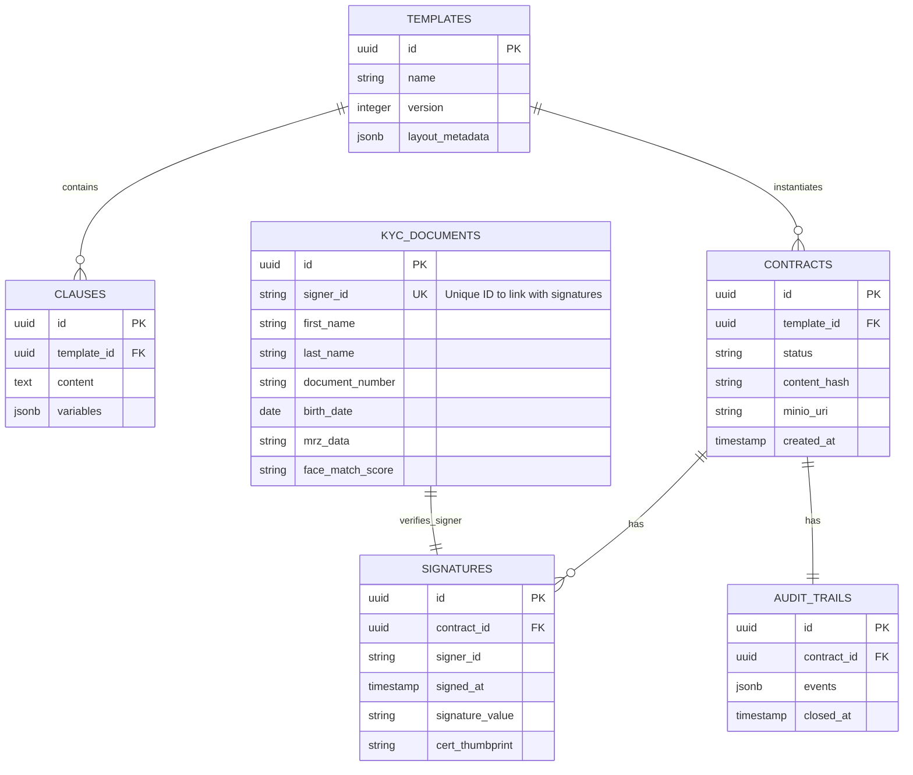

# Database Model & Data Access (EXHAUSTIVE)

## Data Access Layer
- **Framework/Technology**: R2DBC (Reactive Relational Database Connectivity) / Spring Data R2DBC.
- **Base Directory/Package**: `src/main/java/com/aegis/sign/infrastructure/adapter/output`
- **Connection Management**: Connection Pool managed by Spring Boot, configured via `application.yml`.

## Entity Relationship Diagram (ERD) / Schema Map

## Complete Data Structure Inventory
| Name (Table/Coll) | Description / Purpose | Key Fields (PK/FK/Index) | Related Entities | Business Object / Model |
|-------------------|-----------------------|--------------------------|------------------|-------------------------|
| templates         | Contract blueprints.  | PK: id                   | clauses, contracts| Template |
| clauses           | Reusable legal text.  | PK: id, FK: template_id  | templates        | Clause |
| contracts         | Stores metadata and status of contracts. | PK: id, FK: template_id | signatures, audit_trails | Contract |
| signatures        | Individual signatures applied to contracts. | PK: id, FK: contract_id | contracts, kyc_documents | Signature |
| audit_trails      | Immutable logs for legal compliance. | PK: id, FK: contract_id | contracts | AuditTrail |
| kyc_documents     | Validated identity data. | PK: id, UK: signer_id    | signatures       | KycDocument |
| kyc_sessions (Redis) | Temporary session state. | Key: session_id | - | KycSession |
| otps (Redis)      | Temporary OTP codes for consent. | Key: signature_id | - | Otp |

## Relationships and Data Integrity
- **Constraints/Relationships**: 
    - `clauses` -> `templates` (Many-to-One).
    - `contracts` -> `templates` (Many-to-One).
    - `signatures` -> `contracts` (Many-to-One).
    - `audit_trails` -> `contracts` (One-to-One).
    - `kyc_documents.signer_id` matches `signatures.signer_id`.
- **Logic in DB/Storage**: Use of `jsonb` in PostgreSQL for flexible but queryable audit events and clause variables.
- **Identity Generation**: UUIDs (v4) for all primary keys.

## Critical Query Patterns
1. **Contract Assembly**: Joining `templates` and `clauses` to render the PDF.
2. **Audit Trail Retrieval**: Fetching all events for a specific contract ID.
3. **Signer Validation**: Verifying if `signer_id` in a signature request has a matching approved `kyc_documents` entry.

---

### Context & Navigation
- [GEMINI.md](../GEMINI.md)
- [architecture.md](architecture.md)
- [business_logic.md](business_logic.md)
