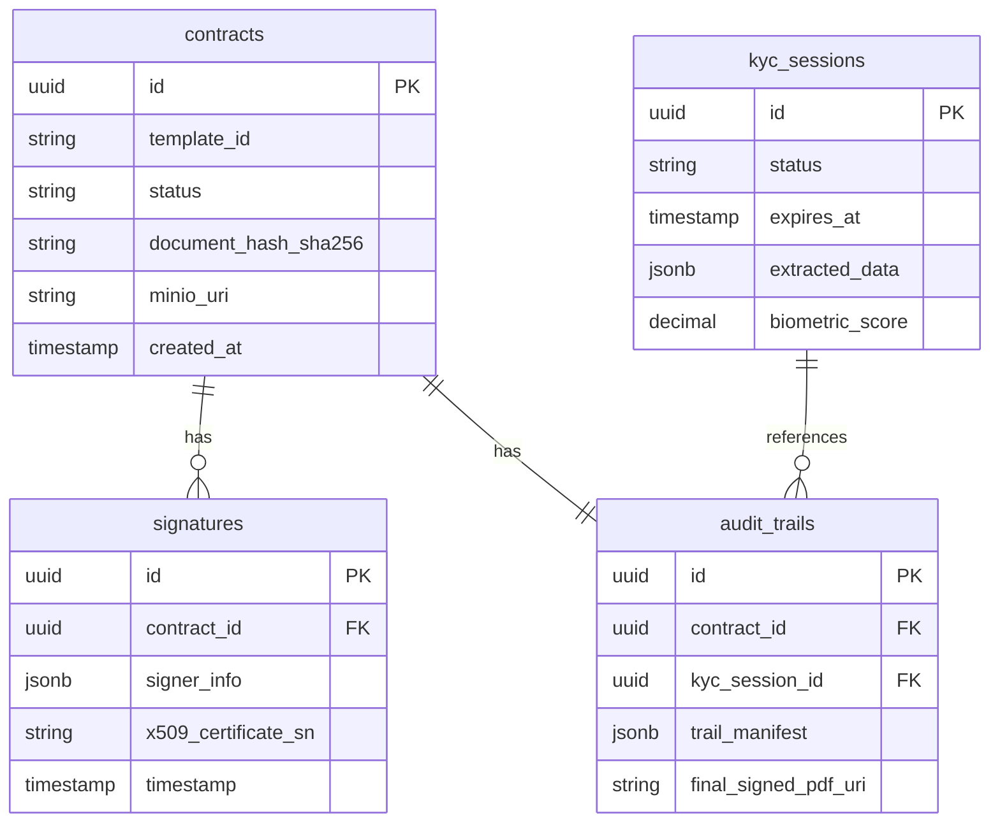

# Database Model & Data Access (EXHAUSTIVE)

## Data Access Layer
- **Framework/Technology**: R2DBC (Reactive Relational Database Connectivity) / Spring Data R2DBC.
- **Base Directory/Package**: `src/main/java/com/aegis/sign/infrastructure/adapter/output`
- **Connection Management**: Connection Pool managed by Spring Boot, configured via `application.yml`.

## Entity Relationship Diagram (ERD) / Schema Map

## Complete Data Structure Inventory
| Name (Table/Coll) | Description / Purpose | Key Fields (PK/FK/Index) | Related Entities | Business Object / Model |
|-------------------|-----------------------|--------------------------|------------------|-------------------------|
| kyc_sessions      | Stores KYC identity verification session details. | PK: id, Index: status, expires_at | audit_trails | KycSession / KycSessionEntity |
| contracts         | Stores metadata and status of contracts to be signed. | PK: id, Index: status, template_id, created_at | signatures, audit_trails | Contract / ContractEntity |
| signatures        | Records electronic signature events on contracts. | PK: id, FK: contract_id, Index: contract_id, x509_certificate_sn | contracts | Signature / SignatureEntity |
| audit_trails      | Immutable legal evidence trail consolidating KYC and signature data. | PK: id, FK: contract_id, kyc_session_id, Index: contract_id, kyc_session_id | contracts, kyc_sessions | AuditTrail / AuditTrailEntity |
| kyc_sessions (Redis) | Cache for fast, temporary KYC session lookups. | Key: UUID | - | KycSession (Ephemeral) |

## Relationships and Data Integrity
- **Constraints/Relationships**: 
    - `signatures.contract_id` -> `contracts.id` (Many-to-One, Cascade On Delete).
    - `audit_trails.contract_id` -> `contracts.id` (One-to-One, Cascade On Delete).
    - `audit_trails.kyc_session_id` -> `kyc_sessions.id` (Many-to-One, Cascade On Delete).
- **Logic in DB/Storage**: Use of `jsonb` in PostgreSQL for flexible but queryable properties:
    - `kyc_sessions.extracted_data`: Holds parsed identity data, including `mrzValid` (boolean), `mrzValidationErrorMessage`, `biometricValid`, and detailed OCR fields.
    - `signatures.signer_info`: Holds signer metadata (e.g. signer ID, IP, user-agent).
    - `audit_trails.trail_manifest`: Holds the complete log of cryptographic events and verification scores.
- **Identity Generation**: UUIDs (v4) for all primary keys.

## Critical Query Patterns
1. **KYC Verification Verification**: Fetching an active, approved `kyc_session` matching the target signer before allowing signature.
2. **Audit Trail Compilation**: Retrieving the consolidated events from the `audit_trails` table for a specific contract.
3. **Signature Event Logging**: Saving a new entry in `signatures` and updating the contract status to `SIGNED`.
---

### Context & Navigation
- [GEMINI.md](../GEMINI.md)
- [architecture.md](architecture.md)
- [business-logic.md](business-logic.md)
