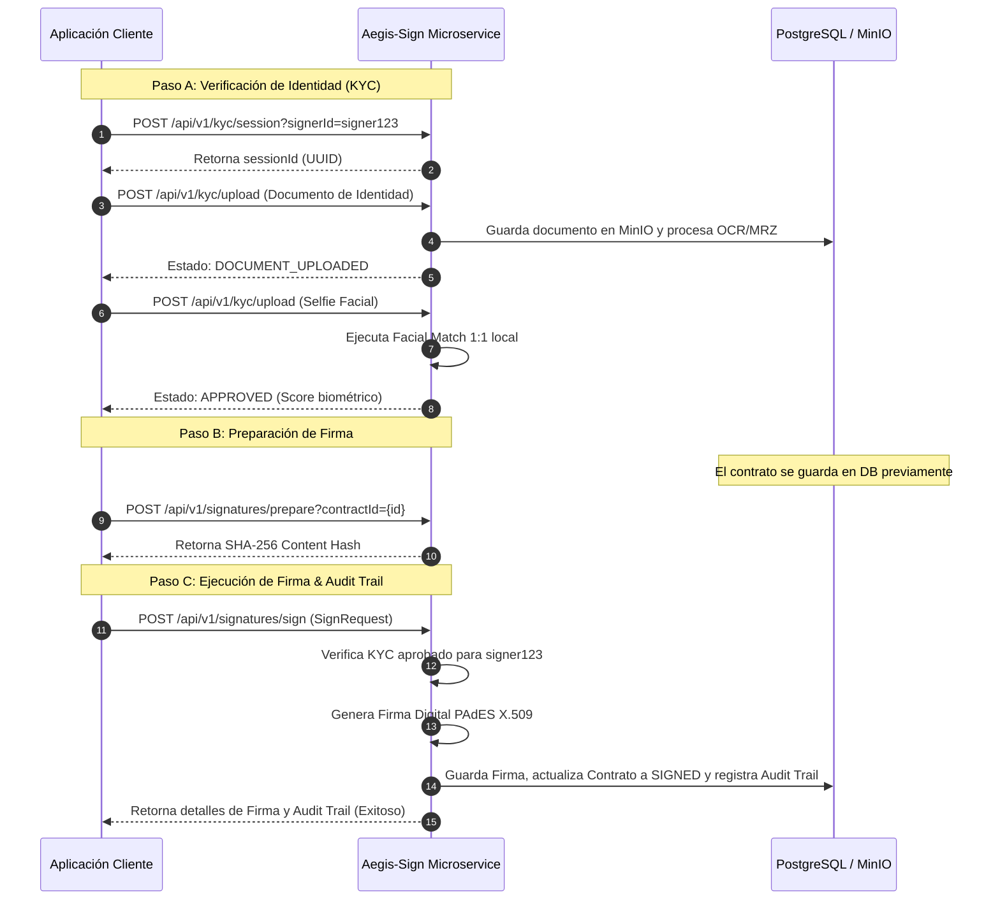

# Manual de Usuario e Integración - aegis-sign

Este manual detalla los pasos para configurar, ejecutar e integrar el microservicio `aegis-sign`, diseñado para gestionar la verificación de identidad (KYC) y la Firma Electrónica Avanzada (FEA) de manera reactiva e inmutable.

---

## 1. Introducción y Arquitectura

`aegis-sign` es un microservicio autónomo (self-hosted) desarrollado sobre una arquitectura hexagonal con programación reactiva. Permite:
- Realizar validación biométrica facial (comparación 1:1) y procesamiento de documentos de identidad (OCR + MRZ según ICAO Doc 9303).
- Compilar y renderizar contratos dinámicos PDF a partir de plantillas estructuradas JSON.
- Aplicar firmas digitales X.509 siguiendo las especificaciones del estándar PAdES (PDF Advanced Electronic Signatures).
- Consolidar evidencias en una pista de auditoría (Audit Trail) con registro inmutable.

---

## 2. Requisitos y Configuración de Infraestructura

El microservicio requiere los siguientes componentes ejecutándose de forma local para garantizar la soberanía de los datos:
1. **PostgreSQL 16+** (Persistencia relacional mediante R2DBC).
2. **Redis 7+** (Caché y control de sesiones).
3. **MinIO** (Almacenamiento compatible con la API de Amazon S3).
4. **Java 21 JDK** para la compilación y ejecución.

### Docker Compose
Para iniciar los servicios dependientes, ejecuta:
```bash
docker compose up -d
```

### Configuración (`application.yml`)
Las variables de conexión principales se configuran en [application.yml](file:///Applications/XAMPP/xamppfiles/htdocs/aegis-sign/src/main/resources/application.yml) y pueden sobreescribirse mediante variables de entorno en producción:
- `spring.r2dbc.url`: URL de conexión reactiva PostgreSQL.
- `spring.data.redis.host` / `spring.data.redis.port`: Dirección del servidor Redis.
- `minio.endpoint` / `minio.access-key` / `minio.secret-key`: Parámetros de conexión a MinIO.

---

## 3. Flujo Completo de Integración E2E

Para completar la firma de un contrato con validación de identidad KYC, la aplicación consumidora debe seguir este flujo lógico:



---

## 4. Referencia de API REST

Todos los endpoints retornan una estructura de respuesta unificada:
```json
{
  "success": true,
  "data": { ... },
  "error": null
}
```

### 4.1. Endpoints de KYC

#### A. Crear Sesión KYC
Inicializa una sesión temporal de verificación de identidad.
- **Ruta:** `POST /api/v1/kyc/session`
- **Parámetros de consulta (Query Parameters):**
  - `signerId` (String, requerido): Identificador único del firmante.
- **Ejemplo de Request:**
  ```bash
  curl -X POST "http://localhost:8080/api/v1/kyc/session?signerId=signer123"
  ```
- **Ejemplo de Response (200 OK):**
  ```json
  {
    "success": true,
    "data": {
      "id": "a9a8f4c2-073c-41fb-89c0-5eb4e6e690a2",
      "status": "PENDING",
      "documentMetadata": {},
      "faceMatchScore": null,
      "signerId": "signer123"
    },
    "error": null
  }
  ```

#### B. Subir Documentos y Fotos (OCR & Biometría)
Carga archivos asociados a la sesión KYC.
- **Ruta:** `POST /api/v1/kyc/upload`
- **Tipo de Contenido:** `multipart/form-data`
- **Parámetros:**
  - `file` (Multipart File): El archivo binario de la imagen (`JPEG`/`PNG`/`PDF`, máx 10MB).
  - `type` (String): El tipo de archivo (`FRONT`, `BACK`, `SELFIE`).
  - `sessionId` (UUID): El identificador de la sesión KYC creada previamente.
- **Ejemplo de Request:**
  ```bash
  curl -X POST "http://localhost:8080/api/v1/kyc/upload" \
    -F "file=@/path/to/selfie.jpg" \
    -F "type=SELFIE" \
    -F "sessionId=a9a8f4c2-073c-41fb-89c0-5eb4e6e690a2"
  ```
- **Ejemplo de Response (200 OK):**
  ```json
  {
    "success": true,
    "data": {
      "id": "a9a8f4c2-073c-41fb-89c0-5eb4e6e690a2",
      "status": "APPROVED",
      "documentMetadata": {
        "SELFIE": "UPLOADED"
      },
      "faceMatchScore": 0.95,
      "signerId": "signer123"
    },
    "error": null
  }
  ```

#### C. Obtener Estado de la Sesión
Consulta los metadatos y el estado actual de una sesión KYC.
- **Ruta:** `GET /api/v1/kyc/session/{id}`
- **Parámetros:**
  - `id` (UUID, path parameter): El ID de la sesión KYC.
- **Ejemplo de Request:**
  ```bash
  curl -X GET "http://localhost:8080/api/v1/kyc/session/a9a8f4c2-073c-41fb-89c0-5eb4e6e690a2"
  ```

---

### 4.2. Endpoints de Firma Electrónica

#### A. Preparar Contrato (Obtener Hash SHA-256)
Obtiene el hash criptográfico SHA-256 del documento del contrato previamente almacenado e inmutable.
- **Ruta:** `POST /api/v1/signatures/prepare`
- **Parámetros de consulta (Query Parameters):**
  - `contractId` (UUID, requerido): El ID del contrato.
- **Ejemplo de Request:**
  ```bash
  curl -X POST "http://localhost:8080/api/v1/signatures/prepare?contractId=b2b1a3e8-5421-4fcd-bc39-a9a38f3214a1"
  ```
- **Ejemplo de Response (200 OK):**
  ```json
  {
    "success": true,
    "data": "e3b0c44298fc1c149afbf4c8996fb92427ae41e4649b934ca495991b7852b855",
    "error": null
  }
  ```

#### B. Ejecutar Firma Digital y Generar Audit Trail
Aplica la firma digital PAdES (X.509) sobre el contrato e inhabilita cambios posteriores, registrando metadatos legales y geográficos.
- **Ruta:** `POST /api/v1/signatures/sign`
- **Cabeceras Recomendadas:**
  - `X-Forwarded-For` (String): Dirección IP de origen del firmante (para Audit Trail).
  - `User-Agent` (String): Navegador/Dispositivo del firmante (para Audit Trail).
- **Cuerpo de la Petición (JSON):**
  ```json
  {
    "contractId": "b2b1a3e8-5421-4fcd-bc39-a9a38f3214a1",
    "kycSessionId": "a9a8f4c2-073c-41fb-89c0-5eb4e6e690a2",
    "signerId": "signer123",
    "certificateThumbprint": "5e883e29f8f3c87e74888d3e29f8f3c8"
  }
  ```
- **Ejemplo de Request:**
  ```bash
  curl -X POST "http://localhost:8080/api/v1/signatures/sign" \
    -H "Content-Type: application/json" \
    -H "X-Forwarded-For: 198.51.100.42" \
    -H "User-Agent: Mozilla/5.0 (Macintosh; Intel Mac OS X 10_15_7)" \
    -d '{
      "contractId": "b2b1a3e8-5421-4fcd-bc39-a9a38f3214a1",
      "kycSessionId": "a9a8f4c2-073c-41fb-89c0-5eb4e6e690a2",
      "signerId": "signer123",
      "certificateThumbprint": "5e883e29f8f3c87e74888d3e29f8f3c8"
    }'
  ```
- **Ejemplo de Response (200 OK):**
  ```json
  {
    "success": true,
    "data": {
      "id": "c1c1f4e3-883c-41fb-89c0-5eb4e6e690e5",
      "contractId": "b2b1a3e8-5421-4fcd-bc39-a9a38f3214a1",
      "signerId": "signer123",
      "hash": "signed-e3b0c44298fc1c149afbf4c8996fb92427ae41e4649b934ca495991b7852b855-5e883e29f8f3c87e74888d3e29f8f3c8",
      "certificateThumbprint": "5e883e29f8f3c87e74888d3e29f8f3c8",
      "timestamp": "2026-05-23T19:50:20"
    },
    "error": null
  }
  ```

---

## 5. Pistas de Auditoría (Audit Trail)

La firma de un contrato genera una entrada inmutable en la tabla `audit_trails`. El JSON resultante contiene información legalmente vinculante:
- **`kyc_session_id`:** Enlace a la sesión biométrica aprobada.
- **`contract_id`:** Contrato firmado.
- **`events`:** Registro de acciones que incluye:
  - Tipo de evento (`SIGNATURE`).
  - Dirección IP (`ipAddress`) de origen capturada desde `X-Forwarded-For`.
  - Firma del navegador (`userAgent`) capturada desde `User-Agent`.
  - Estampa de tiempo exacta del servidor (`timestamp`).
- **`final_signed_pdf_uri`:** Ubicación del PDF inmutable firmado dentro de MinIO.

Esto garantiza el no repudio de la firma y el cumplimiento de normativas de firma electrónica.
